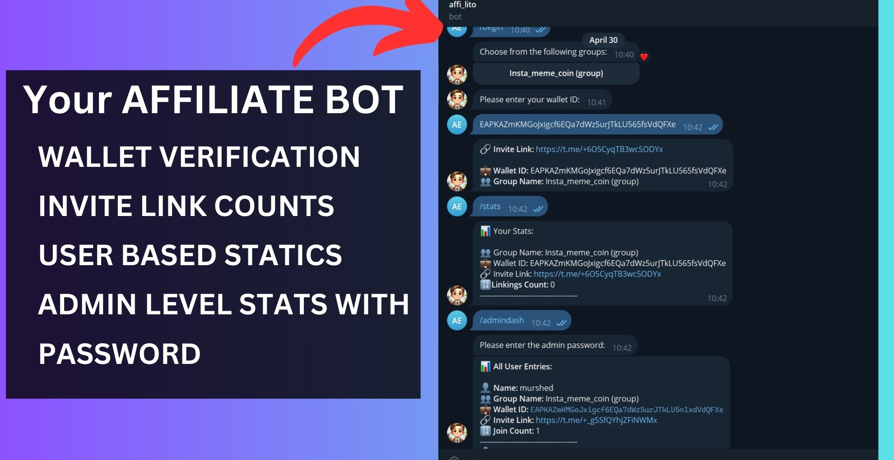

## Contact Me

## Brief 📖
This was developed to maintain a group's affiliate! 
The idea is users can invite people with the link they generate from the group they can see how their links are doing and admin can look how all the person's are doing with a password protection!And later they can get reward for the joinings.

## Gallery

Here is a quick-peak!

  

## Features 📋
⚡️ Solana wallet validation
⚡️ Easy use,Interactive\
⚡️ Valid python\
⚡️ personal Stats\
⚡️ Admin stats-Password_Protected\
⚡️ Super Fast\
⚡️ Easy to setup

## Installation & Deployment 📦
- Clone the repository .
- Create a Bot Token from botfather on telegram
- In `bot.py` replace the bot token,and add the bot into your group-Make it admin
- [Create a free account on alchemy](https://www.alchemy.com)
- Get your own Api_key for solana chain
- Run the Bot! thats it!!

## Tools Used 🛠️

